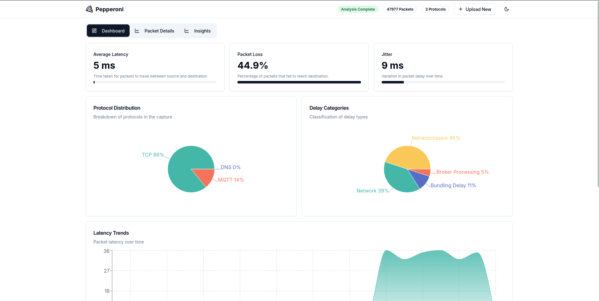
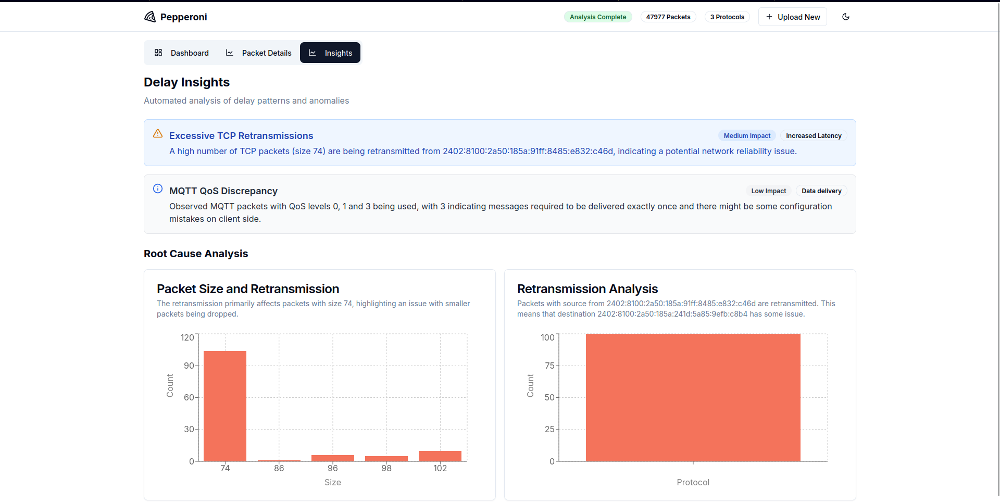
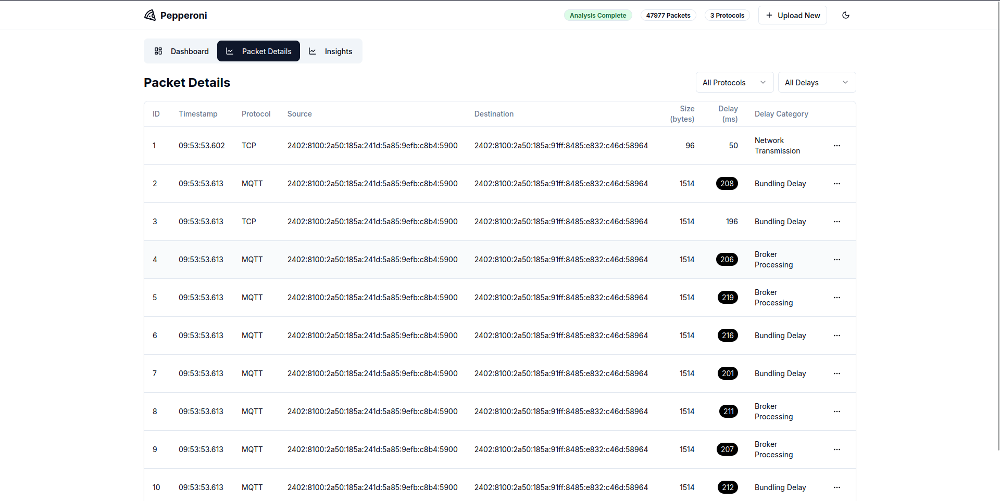

# Pepperoni - PCAPNG Analysis Framework

<div style="display: flex; justify-content: space-around;">
  
  
  
</div>

Pepperoni is a web-based framework designed to analyze PCAPNG files for network traffic insights. It extracts key network features such as packet delays, packet distributions, and other metrics to help with network performance analysis and anomaly detection.

## Features

- **PCAPNG Parsing**: Upload and analyze network capture files.
- **Delay Analysis**: Identify network latency and packet delays.
- **Dashboard Insights**: Interactive UI for visualizing network statistics.
- **Custom Redis Caching**: Optimized caching for improved performance.
- **Full-Stack Implementation**: Backend (FastAPI + Python) and Frontend (Next.js/React with Bun on Tailwind).
- **Gemini LLM Support**: Leverage Gemini LLM for enhanced analysis and insights.

## Installation

### Prerequisites

Ensure you have the following installed:

- Python 3.10+
- Node.js 16+
- Redis (for caching)
- Poetry (for Python package management)
- Bun (for frontend package management)

### Backend (Server) Setup

1. Clone the repository:
   ```bash
   git clone https://github.com/your-username/pepperoni.git
   cd pepperoni/server
   ```
2. Install dependencies using Poetry:
   ```bash
   poetry install
   ```
3. Add your Gemini API key by creating a `.env` file in the `server/` directory:
   ```bash
   echo "GEMINI_API_KEY=your_api_key_here" > .env
   ```
4. Run the backend server:
   ```bash
   poetry run python app.py
   ```

### Frontend (Website) Setup

1. Navigate to the website directory:
   ```bash
   cd ../website
   ```
2. Install dependencies:
   ```bash
   bun install
   ```
3. Run the frontend server:
   ```bash
   bun run dev
   ```
4. Open your browser and go to `http://localhost:3000`.

## Usage

- Upload a `.pcapng` file via the web interface.
- The backend processes the file and extracts key network statistics.
- View insights such as delay distribution, packet counts, and more in the dashboard.
- Utilize Gemini LLM for advanced network analysis.

## Project Structure

```
pepperoni/
├── server/                # Backend
│   ├── app.py            # Main backend script
│   ├── redis_cache.py    # Caching mechanism
│   ├── sample.pcap       # Sample PCAP file
│   ├── pyproject.toml    # Poetry dependencies
│   ├── .env              # Environment variables (Gemini API key)
├── website/              # Frontend
│   ├── app/              # Next.js app components
│   ├── components/       # UI Components
│   ├── styles/           # Styling and CSS
│   ├── pages/            # Web pages
│   ├── package.json      # Frontend dependencies
│   ├── tailwind.config.js# Tailwind CSS configuration
│   ├── tsconfig.json     # TypeScript configuration
│   ├── bun.lock          # Bun lock file
```

## Contribution

We welcome contributions! Feel free to submit issues, feature requests, or pull requests.

## License

MIT License

## Authors
Druva Dhakshinamoorthy, Khushraj Rathod, Advik Raj Basani, Sarang S